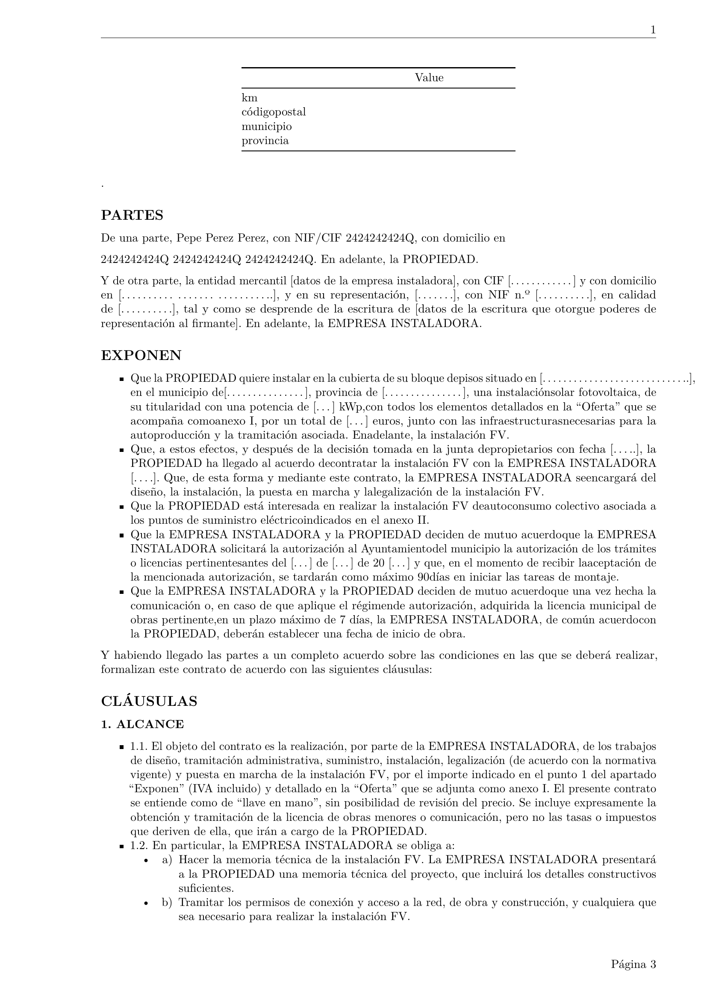

---
hide:
  - footer
  - navigation
  - toc
---

#
 
 
 

Hacia la transición energética

Hola, soy Quico Roman, ingeniero colegiado (26975),  especializado en control, energías renovables, eficiencia y movilidad sostenible.

En este blog incluyo algunos casos prácticos de estudios y proyectos  para el diseño de instalaciones de energía solar fotovoltaica, diseño de la infraestructura de recarga del Vehículo Eléctrico, etc.

 
 
 
 
 
 

    
    
    
    

 

